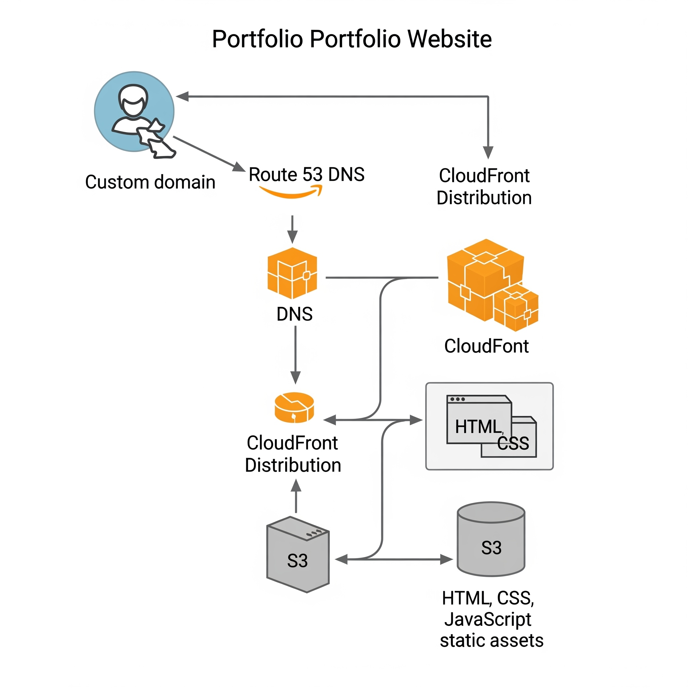
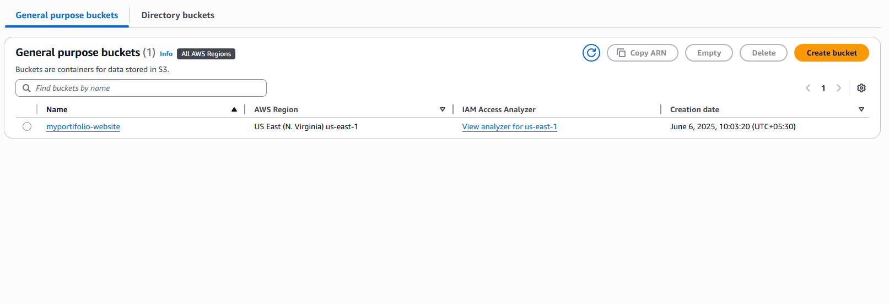
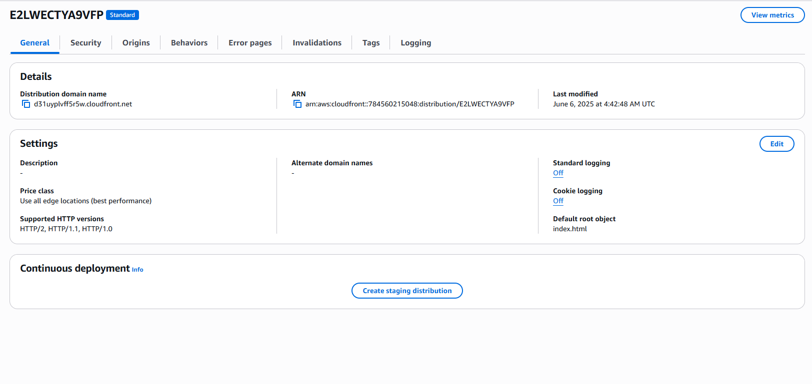
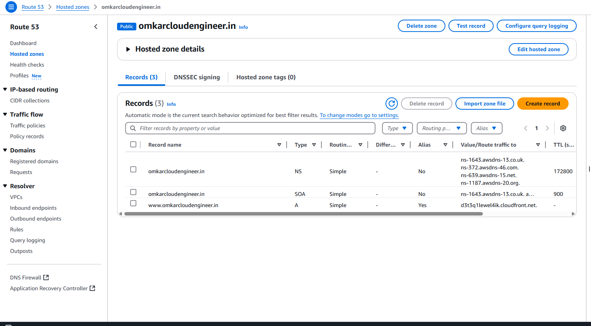
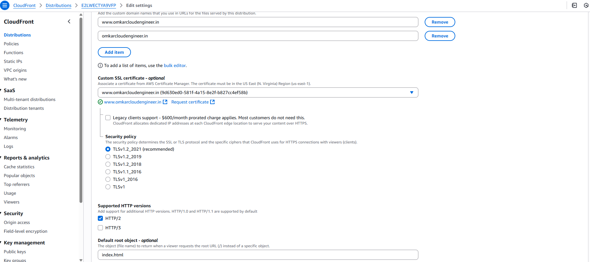

# 🌐 Hosted Portfolio Website on AWS using S3, CloudFront, and Route 53

This project demonstrates how I hosted my personal portfolio website using **AWS services** such as **S3**, **CloudFront**, **ACM**, and **Route 53** for a globally available and secure website.

---

## 🚀 Tech Stack

- **Amazon S3** – Static website hosting
- **Amazon CloudFront** – CDN for performance & HTTPS
- **AWS Certificate Manager (ACM)** – Free SSL certificate
- **Amazon Route 53** – Custom domain routing
- **HTML/CSS** – Portfolio website

---

## 🌍 Live Website

🔗 [https://www.omkarcloudengineer.in/](https://www.omkarcloudengineer.in/)  
(Domain connected via Route 53 and HTTPS secured by CloudFront + ACM)

---

## Network Architecture

---

## 🛠️ Steps to Deploy

### 1. Upload Website to S3
- Create a new S3 bucket
- Enable **static website hosting**
- Upload `index.html` and other files
- Set bucket policy to allow public read access

### 2. Configure CloudFront
- Create a CloudFront distribution
- Set the S3 bucket as origin
- Attach **ACM Certificate** (issued in `us-east-1`)
- Set default root object to `index.html`

### 3. Use Route 53
- Buy or configure a domain in Route 53
- Create A/AAAA (alias) record pointing to CloudFront distribution
- Add **CNAME** records from ACM to verify the certificate

### 4. Test & Go Live
- Visit the domain with HTTPS
- Confirm CloudFront is caching correctly and the certificate is active

---

## 📸 Screenshots 

- **S3 bucket setup**

- **CloudFront**

- **Route53-hosted-zones**

- **SSl-Certificate**

- **Final-Live-Site**

  
---

## 📌 Learnings

- End-to-end setup of AWS static site architecture
- How to configure DNS, SSL, and CDN
- Importance of caching and global distribution

---

## 📬 Contact

Feel free to connect with me on [LinkedIn](https://www.linkedin.com/in/omkar-cloud-engineer/)
---

